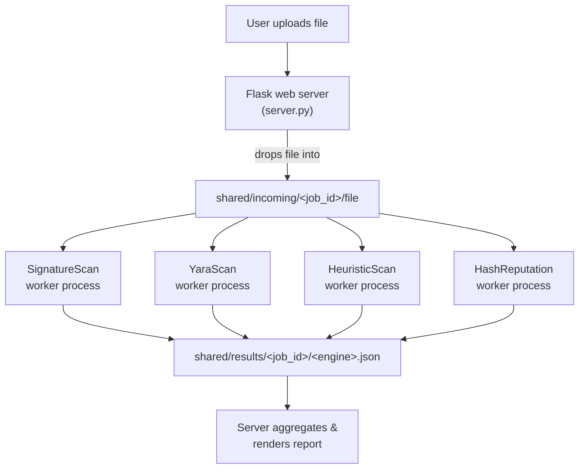

# Antiscan

Antiscan is a VirusTotal-style file scanner: upload a file, **4 independent
scanning engines** analyze it in parallel, and you get an aggregated
verdict with a per-engine breakdown.

## Background

This is a solo rebuild of a project originally built with a university
group. The original member who hosted the code deleted it, so this is a
from-scratch reimplementation of the same architecture and concept.

## Architecture

The original design ran 4 virtual machines, each with a different
commercial antivirus, all watching a shared folder that a host web
server dropped files into. This rebuild keeps the exact same
architecture — **the file system is the API** — but each "VM" is an
independent OS process (an *engine worker*) instead of a full virtual
machine:



Every worker only ever reads `shared/incoming/` and writes
`shared/results/<job_id>/<engine>.json` — it never talks to the server
or to any other worker directly. That means each worker could be moved
to its own machine or VM, pointed at a network-mounted `shared/`, with
**zero code changes** — the natural next step for production hardening
(so a malicious sample can't touch the host serving results).

## The 4 engines

| Engine | Technique | Catches |
|---|---|---|
| `SignatureScan` | Byte/string pattern matching against a local signature DB | Known malicious strings (EICAR, common dropper/shell markers) |
| `YaraScan` | [YARA](https://virustotal.github.io/yara/) rules (`rules/basic.yar`) | Structural patterns: macro-enabled Office docs, obfuscated scripts, embedded PE headers |
| `HeuristicScan` | Shannon entropy + magic-byte vs. extension check | Packed/encrypted payloads, extension masquerading (`invoice.pdf.exe`) |
| `HashReputation` | SHA-256 lookup against `rules/hash_db.json` | Known-bad or known-good files by exact hash |

No engine needs internet access — signatures, rules, and the hash DB
all ship locally, so the whole thing works fully offline.

## Running it

**Linux/macOS:**
```bash
pip install -r requirements.txt
chmod +x run.sh
./run.sh
```

**Windows (PowerShell):**
```powershell
python -m venv venv
venv\Scripts\activate
pip install -r requirements.txt
.\run.bat
```

Then open `http://localhost:5000`.

`samples/eicar.com` is the industry-standard [EICAR test
file](https://en.wikipedia.org/wiki/EICAR_test_file) — safe, and
designed specifically to be recognized by antivirus products without
being real malware. Uploading it through the UI is a good smoke test:
it should come back flagged by `SignatureScan`, `YaraScan`, and
`HashReputation`. Note your own OS antivirus may also flag this file
on disk — that's expected and confirms it's a real, recognized test
signature, not a sign of anything wrong.

## Scope & honesty

This is an architectural/educational demonstration, not a production
antivirus. The 4 engines use real, standard detection techniques
(signature matching, YARA, entropy analysis, hash reputation) but with
small, hand-curated rule sets — they're not meant to compete with
commercial AV coverage. The point is the **system design**: independent,
swappable scanning agents coordinating through a shared store, the same
pattern the original 4-VM build used.

## Extending

- New engine: copy `workers/heuristic_engine.py`, implement
  `scan(path) -> (verdict, detail, score)`, call
  `poll_loop("YourEngineName", scan)`, add the name to `ENGINES` in
  `server.py`.
- New signatures/hashes: edit `SIGNATURES` in `workers/signature_engine.py`
  or `rules/hash_db.json`.
- New YARA rules: edit `rules/basic.yar`.